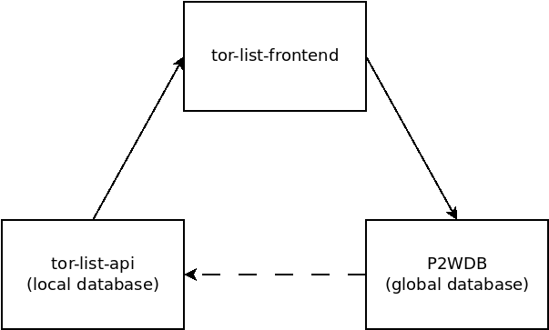

# Developer Documentation

This is living documentation that will be updated, edited, and changed over time, using the same version control as the rest of the code. The purpose of this documentation is to capture and explain how the `bch-dex` interacts with the [P2WDB](https://github.com/Permissionless-Software-Foundation/ipfs-p2wdb-service), to create a permissionless, censorship-resistant database for storing trading orders. A web client will be built in the future that will interact with the REST API of this app.

- [Specification](./specification.md)

# Overview

There are three major pieces of software behind the bch-dex concept. They work together to form a censorship-resistant application for exchanging transaction data for building trades.

- _Client_ could be a web browser like [wallet.fullstack.cash](https://bchn-wallet.fullstack.cash), or a command-line client like [psf-bch-wallet](https://github.com/Permissionless-Software-Foundation/psf-bch-wallet) or [psf-avax-wallet](https://github.com/Permissionless-Software-Foundation/psf-avax-wallet).
- [bch-dex](https://github.com/Permissionless-Software-Foundation/bch-dex) is the back end REST API that maintains a local database of information that the client reads from.
- [P2WDB](https://github.com/Permissionless-Software-Foundation/ipfs-p2wdb-service) is the pay-to-write global database with a REST API for interfacing with the other two pieces of software.

The arrows in the image represent the information flow between the three pieces of software:

- The _Client_ is essentially a 'dummy terminal' with a bidirectional interface to bch-dex. bch-dex does the heavy lifting, and the _Client_ is a 'thin' UI wrapper.
- `bch-dex` imports data from the global P2WDB database into its local database, using a [webhook](https://en.wikipedia.org/wiki/Webhook) (dashed line). It can also custody funds, pay transaction fees, and create an _Offer_ by creating an _Order_ and submitting the data to the P2WDB (solid line).

This architecture keeps the global database highly censorship resistant, while allowing local installations to maintain tight control over the user experience. The goal is to have many redundant copies of `bch-dex` on the network, and to empower individual traders to run their own, private copy, while maintaining a single source of truth via the P2WDB.

# Definitions

The workflow of a token trade has three parts:
1. **Make** - An *Offer* to buy or sell tokens is generated by a user, known as the *Maker*.
2. **Take** - A second user, known as a *Taker*, will *take* the *Offer* by issuing a *Counter Offer*
3. **Accept** - The original *Maker* checks the *Counter Offer* and *Accepts* it by signing and then broadcasting the transaction.

Trades done in this way are both *trustless* and *atomic*:
- **Trustless** - This means that neither party needs to trust the other. The *Maker* gets to review the *Counter Offer* before broadcasting it. The *Maker* can not alter the *Counter Offer* after the *Taker* has signed it.
- **Atomic** - The trade happens in a single transaction. There is no middle-state where the trade can get stuck. It either happens or doesn't, it's state is binary and atomic.

Specific *Entities* are defined in the [specification](./specification.md), but here is a brief summary:
- **Order** represents the *Maker* side of the trade. This entity is internal to `bch-dex`. It is used to track tokens set aside for sale and managed by the wallet controlled by `bch-dex`.
- **Offer** contains most of the same information as an **Order**, but is external to `bch-dex`. This is data submitted to the P2WDB and visible to all users on the network.
- **Counter Offer** is generated by a *Taker*, in order to take the other side of the trade. It contains a partially-signed transaction, ready for review by the *Maker*.

# Back End

This section provides additional information on `bch-dex` and P2WDB back end software.

## P2WDB

The heart of the censorship resistance is the pay-to-write database ([P2WDB](https://github.com/Permissionless-Software-Foundation/ipfs-p2wdb-service)). This is an [OrbitDB](https://orbitdb.org/) peer-to-peer (p2p) database. The write-access rules have been customized to allow anyone to write to the database, so long as they prove that a sufficient quantity of [PSF tokens](https://psfoundation.cash) have been burned, to pay for the write.

Because OrbitDB is a p2p database, no one party holds the 'official' copy of the database. Instead, like a blockchain, the database is replicated among several peers, and they coordinate updates to the database using consensus rules. Peers are free to leave or enter the network. Each peer independently verifies the database entries have sufficient proof-of-burn.

## `bch-dex`

The `bch-dex` replicates a copy of the global P2WDB, but has the ability to apply localized filters to the data before passing it on to the _Client_, to be displayed.

`bch-dex` is based on this [ipfs-service-provider boilerplate](https://github.com/Permissionless-Software-Foundation/ipfs-service-provider). It's a production-ready template for a web server, providing interfaces via REST API over HTTP, as well as JSON RPC over IPFS. It includes many features for building a web app. This includes user management and authentication, REST API and JSON RPC scaffolding, API documentation, Docker container generation, and extensive test coverage. It's intended to be customized for the needs of the website administrator.

- [Specification](./specification.md)

# Workflows

This section describes the protocols for the database interactions between the three main software components.

These are just a brief, high-level overview. Review the [Specifications](./specification.md) for more details.

## Reading from the Local Database

The *Client* reads data from the local database stored by `bch-dex`, and does not read the P2WDB global database directly. This gives `bch-dex` the opportunity to filter and modify the data locally, for a more controlled user experience.

## Making an Offer

Adding data to the global P2WDB is triggered by the _Client_ calling a REST API endpoint on `bch-dex`. The [p2wdb npm library](https://www.npmjs.com/package/p2wdb) can be leveraged for easy reading and writing to the P2WDB.

Writing data follows these steps:

- Tokens and BCH are held by a wallet which is under the controlled of `bch-dex`.
- The _Client_ submits data to the POST `/order` REST API endpoint to create a new Order.
- `bch-dex` will move the funds into a segregated UTXO, and will use that UTXO to create an Order. The Order data is written to the P2WDB. The Order data is also saved to the local MongoDB.
- After submitting the data to the P2WDB, `bch-dex` will receive a webhook call to its POST `/p2wdb` endpoint by the P2WDB. This event will trigger the import of the new data into the apps local Mongo database, and generate a new Offer model.
- This webhook event is mirrored by every instance of `bch-dex` on the network. Each P2WDB peer on the network will independently validate the new database entry and create a new Offer model.

## Taking an Offer

Users can browse the Offers tracked by a local `bch-dex` by using a *Client*. When they find an Offer they want to to take, they'll use some UI element that will send data to the POST `/offer/take` REST API endpoint. These series of steps happen:

- The `bch-dex` checks to see if the wallet it controls has enough BCH to take the other side of the Offer. If it does, the funds for the offer are moved to a segregated UTXO.
- The new UTXO is used to generate a *Counter Offer*, which contains a partially signed transaction saved as a hex string.
- The *Counter Offer* is uploaded to the P2WDB. This triggers a webhook event in every running instance of `bch-dex` on the network.
- When the webhook is triggered, `bch-dex` will check to see if the *Counter Offer* matches an *Order* under its control. If a match is found, it will trigger an *Accept* event.

## Accepting a Counter Offer

This part of the process is automated and does not require input from the user.

- When a *Counter Offer* is received that matches an *Order* tracked by the local copy of `bch-dex`, it will trigger the *Acceptance* phase.
- In the *Acceptance* phase, the transaction will be checked to see if it matches the conditions in the original *Order*. If all checks pass, `bch-dex` will sign the transaction and broadcast it, completing the trade.
- A 'garbage collection' function that runs periodically will delete Orders and Offers in bch-dex that have had their UTXO spent, automatically cleaning up stale trade data that is no longer valid.

## Maintenance

Occasional maintenance functions will be called by an interval timer. The primary purpose of these functions is to check the UTXOs in the Order, Offer, and Counter Offer entities. If any of these UTXOs are spent, the entity is deleted from the local Mongo database.
